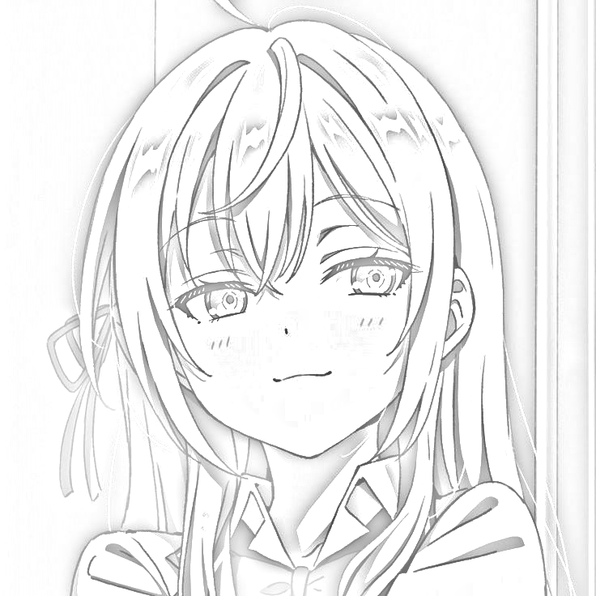

# Pencil Sketch Effect Script

This Python script generates a **pencil sketch effect** from a given image. It converts an image into a grayscale sketch with a realistic hand-drawn look using Gaussian blur and a dodge blend technique.

## Features

- Converts any input image into a grayscale pencil sketch.
- Allows customization of the blur level (intensity of the sketch effect).
- Saves the final sketch image to a specified location.

---

## Requirements

### Dependencies

Before running the script, ensure the following Python libraries are installed:

- `numpy`
- `imageio`
- `opencv-python` (OpenCV)
- `scipy`

To install these, run:
```bash
pip install numpy imageio opencv-python scipy
```

---

## How It Works

The script uses the following steps to create the pencil sketch effect:

### Convert to Grayscale:
Converts the input image from RGB to grayscale using a weighted average formula.

### Invert Colors:
Inverts the grayscale image to create a "negative" effect.

### Apply Gaussian Blur:
Applies a Gaussian blur to the inverted image, creating smooth transitions.

### Blend with Dodge Effect:
Combines the blurred image and the original grayscale image using the "dodge" blending formula:

\[
\text{Result} = \frac{\text{Front} \times 255}{255 - \text{Back}}
\]

### Save the Output:
Saves the resulting sketch as a PNG file.

---

## Usage

### Input Parameters

The script accepts three main inputs:

1. **`image_path` (str)**: Path to the input image file (e.g., `test.jpeg`).
2. **`output_path` (str)**: Path to save the resulting sketch (e.g., `test_coloring.png`).
3. **`blur_sigma` (float)**: Intensity of the Gaussian blur (default is `10`).

---

### Run the Script

1. Place the script and the input image in the same directory (or specify the full paths).

2. Run the script from the command line or an IDE:

   ```bash
   python main.py
   ```

By default, it will use:

- **Input image**: `test.jpeg`
- **Output image**: `test_coloring.png`
- **Blur intensity (sigma)**: `10`

The resulting sketch will be saved to the specified output path.

---

## Customization

To modify the blur intensity:

1. Open the script.
2. Adjust the `blur_sigma` parameter in the `pencil_sketch` function.

For example:

```python
pencil_sketch(input_image, output_image, blur_sigma=15)
```

---

## Notes

- **Supported Formats**: The script supports most common image formats such as JPEG, PNG, BMP, etc.
- **Error Handling**: Ensure the input image path is correct, and the output directory is writable.
---

## Output Example

### Final Sketch Output


